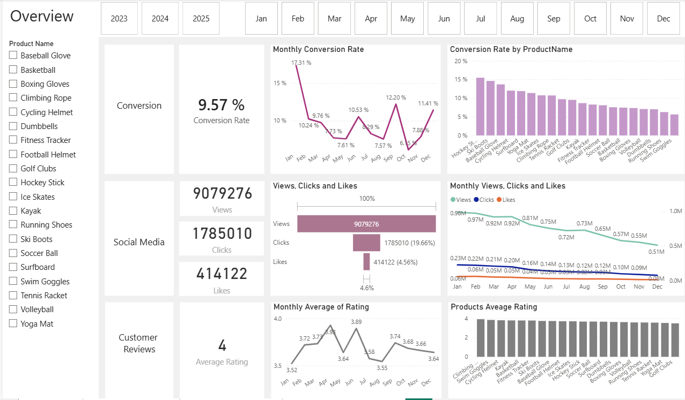

# 📊 Marketing Analytics — From Data to Marketing Insights

**End-to-end Marketing Analytics project using SQL, Python and Power BI to understand customer behavior, marketing engagement, conversion and customer satisfaction.**

---

## 🎯 Business Problem

Marketing teams have access to large amounts of customer and marketing data, but raw data does not automatically translate into actionable decisions.

The business needed to answer critical questions such as:

* **Who are our customers and what characterizes them?**
* **Which marketing and social media activities generate the most engagement?**
* **How do customers progress through the purchasing journey?**
* **Where are potential conversion bottlenecks?**
* **Which products and campaigns attract the most attention?**
* **How satisfied are customers with their experience?**
* **What are customers actually saying in their reviews?**

The main challenge was therefore to transform fragmented customer, product, engagement, journey and review data into **one reliable analytical view that marketing teams could use to make data-driven decisions.**

---

# 💡 Solution

I designed an end-to-end analytics pipeline combining **SQL, Python and Power BI**.

```text
                 RAW MARKETING DATA
                         │
                         ▼
              ┌─────────────────────┐
              │      SQL SERVER     │
              │                     │
              │ Cleaning            │
              │ Transformation      │
              │ Data Quality        │
              │ Analytical Views    │
              └──────────┬──────────┘
                         │
             ┌───────────┴───────────┐
             │                       │
             ▼                       ▼
      ┌──────────────┐       ┌────────────────┐
      │    PYTHON    │       │    POWER BI    │
      │              │       │                │
      │ Sentiment    │       │ KPIs           │
      │ Analysis     │       │ Visualizations │
      │ with VADER   │       │ Dashboard      │
      └──────┬───────┘       └───────┬────────┘
             │                       │
             └───────────┬───────────┘
                         ▼
                 BUSINESS INSIGHTS
```

### SQL — Building a reliable analytical dataset

SQL Server was used to clean and transform the raw data and create analytical views covering:

* Customers & geography
* Products & price categories
* Marketing engagement
* Customer journeys
* Customer reviews

The preparation included data cleaning, transformation, deduplication, missing-value treatment and the creation of business-oriented metrics.

### Python — Understanding customer sentiment

Customer review text was enriched using **VADER sentiment analysis**.

Instead of analyzing ratings alone, the project combines:

**Rating + Review Text + Sentiment Score**

to obtain a deeper understanding of customer experience.

### Power BI — Turning analysis into decisions

The prepared data was transformed into an interactive dashboard covering four key business perspectives:

* **Overview**
* **Social Media Performance**
* **Conversion**
* **Customer Reviews & Sentiment**

---

# 📊 Dashboard

## Executive Overview

The Overview page provides a consolidated view of the main marketing and customer indicators, giving decision-makers a quick understanding of overall performance.



---

## 📱 Social Media Performance

This page focuses on digital engagement and helps identify which marketing activities and content generate customer interactions.

It provides visibility into metrics such as:

* Views
* Clicks
* Likes
* Content performance
* Campaign engagement
* Engagement trends


---

## 🔄 Conversion Analysis

The Conversion page analyzes the customer journey from interaction to conversion.

It helps identify:

* Customer journey stages
* Conversion performance
* Customer actions
* Journey duration
* Potential drop-off points
* Products associated with customer progression


---

## ⭐ Customer Reviews & Sentiment

This page combines traditional customer ratings with NLP-based sentiment analysis.

The objective is to go beyond:

> **"What rating did the customer give?"**

and answer:

> **"What is the customer actually expressing?"**

The analysis identifies positive, negative, neutral and mixed customer feedback.


---

# 📈 Results & Business Insights

The project provides a unified view of **customer behavior, marketing engagement, conversion and customer experience**.

### 👥 Customer Behavior

The analysis makes it possible to identify customer characteristics and geographic patterns, providing a foundation for better segmentation and targeted marketing strategies.

### 📱 Marketing Engagement

The social media analysis allows marketing teams to compare engagement across different types of content and campaigns.

This helps answer:

* Which content attracts the most attention?
* Which activities generate interactions?
* Where should marketing efforts be prioritized?

### 🔄 Customer Conversion

The customer journey analysis provides visibility into how customers move through different stages.

This allows teams to identify potential friction points and opportunities to optimize the conversion funnel.

### ⭐ Customer Experience

Combining ratings with sentiment analysis provides a richer understanding of customer satisfaction.

A numerical rating alone can hide important information contained in the customer's written feedback. Sentiment analysis makes this information easier to analyze at scale.

### 🎯 Overall Business Value

The project turns multiple disconnected datasets into a **single analytical decision-support solution**.

The resulting workflow is:

```text
Raw Data
   ↓
Reliable Data
   ↓
Customer & Marketing Analysis
   ↓
Interactive Dashboard
   ↓
Actionable Business Insights
```

This enables marketing teams to move from **descriptive reporting toward data-driven decision-making.**

---

# ❓ Business Questions Answered

The solution was designed around practical marketing questions:

| Business Area          | Questions Answered                                                              |
| ---------------------- | ------------------------------------------------------------------------------- |
| **Customers**          | Who are our customers? Where are they located?                                  |
| **Products**           | Which products attract the most attention? How do price categories perform?     |
| **Engagement**         | Which content and campaigns generate the strongest engagement?                  |
| **Customer Journey**   | How do customers progress through the journey? Where are potential bottlenecks? |
| **Conversion**         | Which stages and interactions are associated with conversion?                   |
| **Reviews**            | How do customers rate their experience?                                         |
| **Sentiment**          | Is customer feedback predominantly positive, negative or neutral?               |
| **Marketing Strategy** | Where should marketing teams focus their optimization efforts?                  |

---

# 🛠️ Tools & Technologies

| Tool                 | Purpose                                                                |
| -------------------- | ---------------------------------------------------------------------- |
| **SQL Server / SQL** | Data cleaning, transformation, joins, aggregation and analytical views |
| **Python**           | Data analysis and customer review enrichment                           |
| **Pandas**           | Data manipulation                                                      |
| **NLTK / VADER**     | Sentiment analysis                                                     |
| **Power BI**         | Interactive dashboards and data visualization                          |
| **DAX**              | Business metrics and analytical calculations                           |
| **Git / GitHub**     | Version control                                                        |

---

# 🚀 Future Improvements

The current solution provides a strong foundation, but several improvements could increase its business value.

### 1. Advanced Customer Segmentation

Implement customer segmentation using **RFM analysis** and clustering techniques to identify groups such as:

* High-value customers
* Loyal customers
* At-risk customers
* New customers

### 2. Predictive Conversion Analysis

Build a machine learning model to predict the probability that a customer will convert based on:

* Customer profile
* Product interactions
* Engagement
* Journey behavior

This would move the project from **descriptive analytics to predictive analytics**.

### 3. Advanced NLP

VADER provides general sentiment classification. A future version could use transformer-based models such as **BERT** to perform:

* More contextual sentiment analysis
* Aspect-based sentiment analysis
* Automatic identification of product/service issues
* Topic extraction from reviews

### 4. Marketing Campaign Optimization

Extend the analysis to calculate marketing KPIs such as:

* Conversion Rate
* Click-Through Rate
* Customer Acquisition Cost
* Return on Ad Spend
* Customer Lifetime Value

This would allow the dashboard to move from monitoring performance toward **marketing ROI optimization**.

### 5. Automated Data Pipeline

The current analytical workflow could be transformed into an automated pipeline with scheduled data ingestion, transformation and dashboard refresh.

This would enable marketing teams to work with **continuously updated insights rather than static datasets**.

---

# 🎓 Skills Demonstrated

This project demonstrates the ability to combine:

**Data Engineering**

SQL • Data Cleaning • Transformation • Data Quality • Analytical Views

**Data Analysis**

Customer Analytics • Marketing Analytics • Journey Analysis • KPI Analysis

**NLP**

Text Analysis • Sentiment Analysis • VADER

**Business Intelligence**

Power BI • DAX • Dashboard Design • Data Storytelling

**Business Thinking**

Problem Definition • Business Questions • Insight Generation • Decision Support

---

# 👩‍💻 Author

**Karima LACHHEB**

